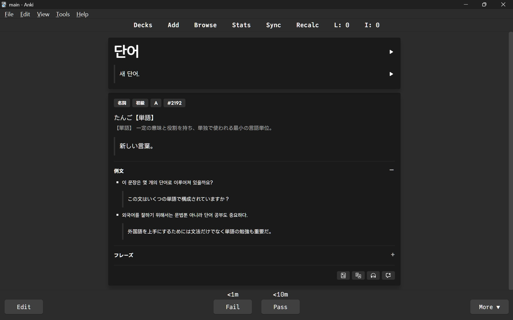

# 韓国語6000

[国立国語院が作成した韓国語学習用語彙のリスト](https://www.korean.go.kr/front/etcData/etcDataView.do?mn_id=46&etc_seq=71)の全単語5,965語を元にAnkiデッキを作成した。

主に[韓国語基礎辞典](https://krdict.korean.go.kr/)を元に以下のデータを得た。
- 見出し語
- 見出し語訳
- 語釈訳
- 品詞
- 原語（漢字/Alphabet）
- 学習レベル
- 重要度
- 頻度順位
- 例文
- 例文訳

## 課題

- データが古い（2003年作成）
- 例文がない、又は学習に不向きなものがある
- 例文の翻訳（Google翻訳）の精度が悪い